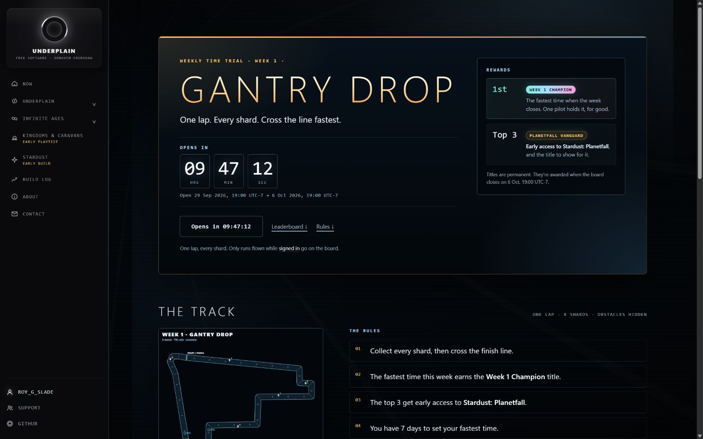
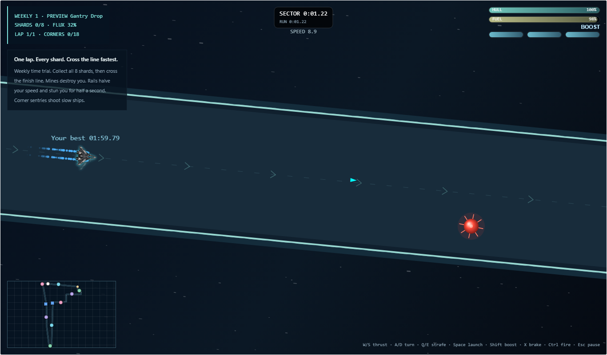

Stardust has a new challenge: **Gantry Drop**, the first weekly time trial. The [weekly page](../../stardust/weekly/) is up now with the track map, rules and countdown. Racing opens **September 29 at 7 p.m. Pacific** and runs through October 6 at 7 p.m. Pacific.

<figure>
  
  <figcaption>The live weekly page before the first race opens. The countdown changes as launch gets closer.</figcaption>
</figure>

The goal is simple to explain and harder to fly: collect all eight shards in one lap, then cross the finish line. Mines end a run. Bouncing asteroids, corner sentries and rails punish sloppy turns. You can see the route before launch, but the hazards stay hidden until you're on the track.

<figure>
  
  <figcaption>Development preview: a best-time ghost on Gantry Drop. The weekly race has not opened yet.</figcaption>
</figure>

I wanted your next lap to have someone to chase, even when nobody else is online. The game records each weekly run so your best-time ghost can fly beside you; once the board has a leader, you can chase that pilot's ghost too. The new race simulation was built for repeatable timing, and the PR's local tests replayed a finished lap to the same time. That's promising engineering evidence, but the public board still needs its first real week of pilots.

This update also adds preset avatars, earned titles and optional public pilot profiles. Your avatar and title can appear beside your times and comments. A public profile is a choice in your account settings; you can leave it off. When the week closes, the fastest eligible pilot is slated for the **Week 1 Champion** title, and the top three for **Planetfall Vanguard** plus early access to *Stardust: Planetfall*. Signed-in runs count for rewards; staff times are unranked.

[See the weekly track and countdown](../../stardust/weekly/) · [Read the merged change](https://github.com/RoyGSlade/DonavenCrenshaw/pull/17)
