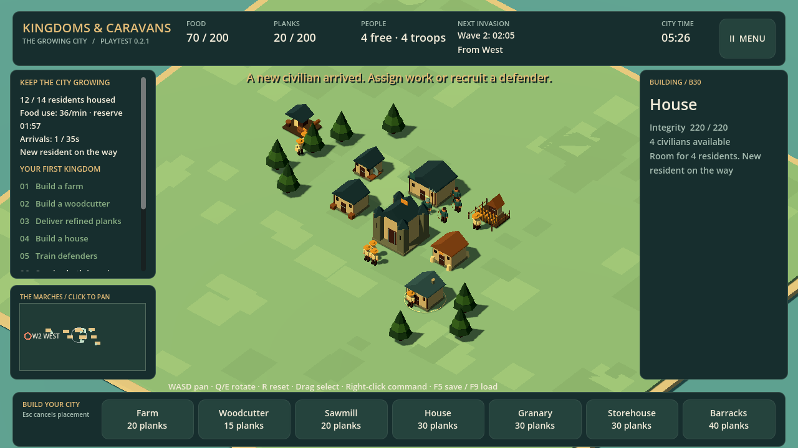
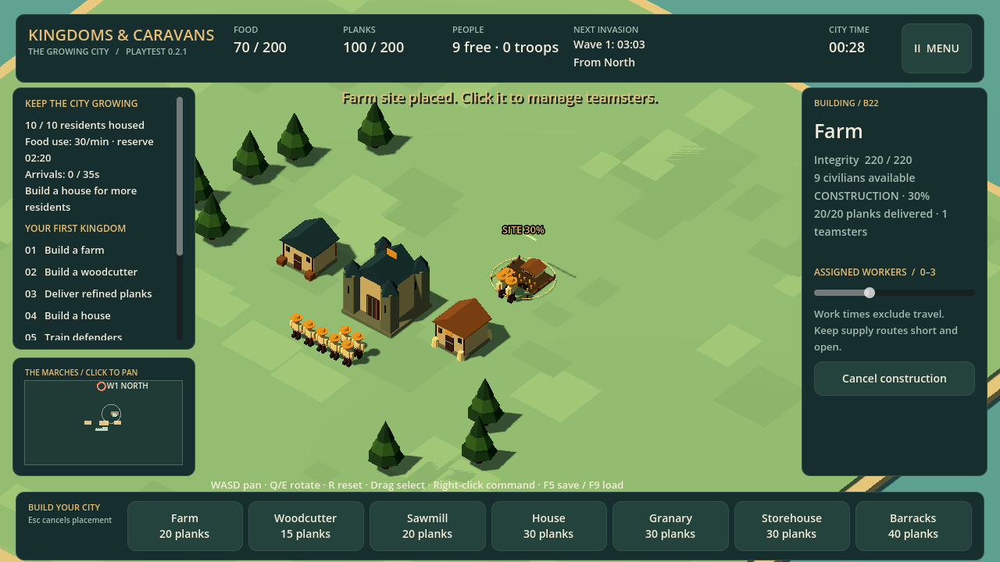
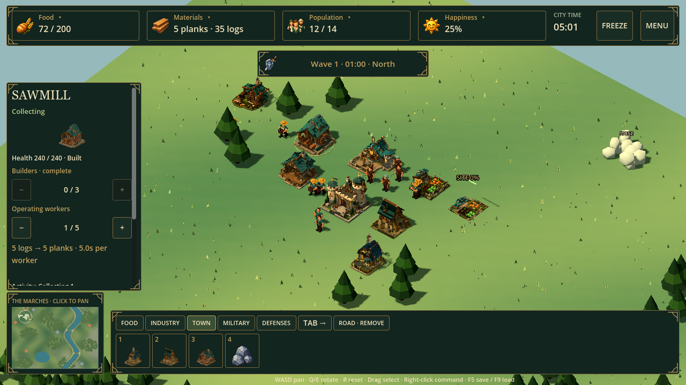
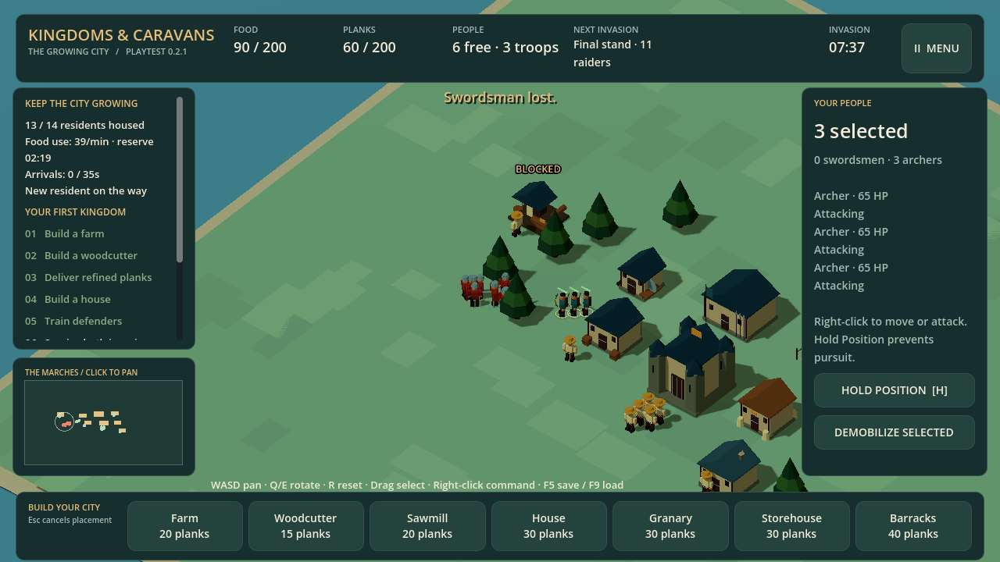

<header class="kc-hero">
  

    
 AVAILABLE TO PLAY · VERY EARLY PREVIEW / WORK IN PROGRESS

    <h1>Kingdoms &amp; Caravans</h1>
    
A small city. A fight worth preparing for.

    
Build a settlement that works. Keep food, stone, planks, and iron moving, then turn walls, stairs, and garrisons into a defense you can actually command.

    

      <a class="kc-download" href="https://github.com/RoyGSlade/KingdomsAndCaravans/releases/download/v0.3.2/KingdomsAndCaravans-windows.zip">Download for Windows ↘<small>Free playtest · x64 · 38.1 MB installer + 164.9 MB game</small></a>
      <a class="kc-text-link" href="#gameplay">See the game ↓</a>
    

    
Single player · Plays offline · Mouse &amp; keyboard Very early, unsigned work in progress. Expect rough edges and balance changes.

  

  <figure class="kc-hero-image">
    
    <figcaption>THE GROWING CITY Actual gameplay · Full size ↗</figcaption>
  </figure>
</header>

  
<strong>Raids at 6 &amp; 14 minutes</strong>Guided opening, then two invasions

  
<strong>A growing settlement</strong>Construction, supplies &amp; housing

  
<strong>Build a defense</strong>Walls, stairs, gates &amp; garrisons

  
<strong>Time to think</strong>Freeze, build once, then play

<nav class="kc-jump-links" aria-label="On this game page"><a href="#gameplay">Gameplay tour</a><a href="#first-run">Your first run</a><a href="#build-status">Build &amp; evidence</a><a href="#play-guide">Install &amp; controls</a><a href="#feedback">Give feedback</a></nav>

<section class="kc-section" id="gameplay" aria-labelledby="gameplay-title">
  

WATCH THE CITY WORK
<h2 id="gameplay-title">Every defender costs you a worker.</h2>
The same people build your town, run its economy, and become your army. More soldiers can save the castle. Recruit too many, and the city that feeds them stops working.

  

    <article class="kc-scene">
      <a class="kc-shot" href="../assets/kingdoms-caravans/construction.png" target="_blank" rel="noopener" aria-label="Open full-size construction screenshot">View full size ↗</a>
      
01 / BUILD<h3>A blueprint needs people.</h3>
Teamsters haul planks to a site before building it; stone and iron construction costs are committed when the order is placed. Hover, click, or use the hotkey to read a building's description and cost. Freeze the simulation when you need to think; one valid construction can be placed during each freeze.

    </article>
    <article class="kc-scene">
      <a class="kc-shot" href="../assets/kingdoms-caravans/supply.png" target="_blank" rel="noopener" aria-label="Open full-size sawmill and supply screenshot">View full size ↗</a>
      
02 / SUPPLY<h3>Resources have a journey.</h3>
Workers find the nearest reachable resource node, even when it is far away. Wood becomes planks, stone feeds fortifications and roads, and iron starts the smithing chain. Roads are worker-built 2 × 2 stone patches; their speed bonus starts when construction is complete.

    </article>
    <article class="kc-scene">
      <a class="kc-shot" href="../assets/kingdoms-caravans/city.png" target="_blank" rel="noopener" aria-label="Open full-size growing city screenshot">View full size ↗</a>
      
03 / GROW<h3>Room to grow. Mouths to feed.</h3>
Houses create space for newcomers; a staffed farm and a food reserve let them arrive. Everyone eats, including troops. Shortages slow work and weaken your defense, so growth needs a working economy behind it.

    </article>
    <article class="kc-scene">
      <a class="kc-shot" href="../assets/kingdoms-caravans/defense.png" target="_blank" rel="noopener" aria-label="Open full-size defense building controls">View full size ↗</a>
      
04 / DEFEND<h3>Build the high ground before they arrive.</h3>
Stairs connect directly to garrisons or through connected wall and gate decks. Post archers on walls and garrisons, then use the translucent green destination circles to see where troops are headed. Survive both waves with the castle standing, then continue building if you want.

    </article>
  

  
In-engine gameplay and interface captures. The developed city comes from an automated playthrough using normal commands and starting supplies; the inspector images demonstrate individual controls. Select an image to inspect the interface.

</section>

<section class="kc-section kc-first-run" id="first-run" aria-labelledby="first-run-title">
  

YOUR FIRST RUN
<h2 id="first-run-title">Build the city that will keep you alive.</h2>
You start with ten civilians and a supply of food and planks. Here is a useful opening, with room to find your own.

  <ol class="kc-opening">
    <li>01
<h3>Secure food.</h3>
Place a farm near the granary. Let teamsters finish it, then keep it staffed. Your starting food will not last forever.

</li>
    <li>02
<h3>Connect the wood economy.</h3>
Put a woodcutter near trees and a sawmill along the route to the storehouse. Click buildings to adjust workers and read production status.

</li>
    <li>03
<h3>Make room, then recruit.</h3>
Add housing while keeping spare food. Build a barracks and turn some citizens into defenders. Keep enough civilians to supply the town.

</li>
  </ol>
  
<strong>Before each invasion, make a choice.</strong>
Another farm, a house, a road, or another archer? If the city needs workers back, demobilize a selected soldier. Watch the invasion warning, use the minimap to find the approach, and spend a freeze on one deliberate construction when the timing matters.

  
Woodcutter<b aria-hidden="true">→</b>Logs<b aria-hidden="true">→</b>Sawmill<b aria-hidden="true">→</b>Planks in storage<b aria-hidden="true">→</b>Your next building

</section>

<section class="kc-section" id="build-status" aria-labelledby="build-status-title">
  

THE BUILD BEHIND THE SCREENSHOTS
<h2 id="build-status-title">What you are downloading.</h2>
Version 0.3.2 is a very early Windows x64 preview of Kingdoms &amp; Caravans. The Growing City is a small survival RTS slice, and this candidate focuses on readable building decisions, connected fortifications, and a defense you can play through.

  

    <article class="kc-panel"><h3>In the game today</h3><ul><li>One map, two raider waves, guided opening, and a Continue Building flow after victory.</li><li>Vegetable, wheat, dairy, and meat food groups with happiness, immigration, recipes, and troop meal effects.</li><li>Physical construction with building descriptions and material costs on hover, click, and hotkey selection.</li><li>Food, housing, logs, planks, stone, iron, and an equipment industry for swords, shields, armor, and trained heavy troops.</li><li>Walls, stairs, gates, garrisons, archer posts, connected deck access, and wall or garrison firing.</li><li>Worker-built 2 × 2 roads that grant speed after completion, plus nearest-reachable-node gathering without a distance cap.</li><li>Compact category building bar, 1–0 selection, Tab category cycling, freeze/play, local saves, and an in-game updater.</li></ul></article>
    <article class="kc-panel kc-panel-muted"><h3>Still a very early preview</h3><ul><li>The raid scenario has two invasions. Continue Building keeps the city running afterward; there is no campaign or endless invasion mode.</li><li>Caravans and multiplayer are not in this build.</li><li>Balance, clearer teaching, polish, and broader hardware testing need more play.</li><li>The Windows executable is unsigned. This is work in progress, not a finished release.</li></ul></article>
  

  

PLAYTEST CHECK · SEPTEMBER 7, 2026
<h3>Played through. Systems checked.</h3>
The current candidate was playtested through the new fortification, freeze/play, resource, road, building-bar, and archer-posting flows. Focused simulation and native interface checks passed, and the standalone Windows export launched cleanly in the recorded local run. That is useful evidence for this preview; it does not establish compatibility with every PC or polished balance.

<a href="https://github.com/RoyGSlade/KingdomsAndCaravans/releases/tag/v0.3.2">Release notes &amp; checksums ↗</a><a href="../assets/kingdoms-caravans/playtest-evidence.json">Capture &amp; build evidence ↗</a><a href="https://github.com/RoyGSlade/KingdomsAndCaravans">Download repository ↗</a>

</section>

<section class="kc-section" id="play-guide" aria-labelledby="play-guide-title">
  

GET PLAYING
<h2 id="play-guide-title">Install. Launch. Build.</h2>
Windows x64, mouse, and keyboard. No Godot or Blender installation, game account, or connection is needed to play after downloading.

  

    <article class="kc-panel"><h3>Install the playtest</h3><ol><li>Download and extract the small Windows installer ZIP.</li><li>Run <code>KingdomsAndCaravans.exe</code> and choose <strong>Install and play</strong>. It downloads and verifies the full game.</li><li>Begin a new kingdom or load your existing save. The same executable works offline after installation.</li></ol>
Windows may warn about this unsigned executable. The release page identifies the build and provides its checksum. Keep Windows security protections enabled.
</article>
    <article class="kc-panel"><h3>Update when you choose</h3>
<strong>Coming from 0.2.1 or 0.3.0?</strong> Use your existing updater. The small compatibility installer downloads and verifies the full game while keeping your save and old installation.  Select <strong>Check for updates</strong> in the menu. If a newer build is offered, choose <strong>Download update</strong>, then <strong>Restart with update</strong> when ready.

Your kingdom is saved before switching. If the download fails or is cancelled, your previous shortcut stays usable. After installation the same shortcut opens the game offline. GitHub checks and downloads need an internet connection.

For installation without a connection on the playing PC, download the <a href="https://github.com/RoyGSlade/KingdomsAndCaravans/releases/download/v0.3.2/KingdomsAndCaravans-full-windows.zip">full Windows ZIP</a> on another PC and extract it. Keep your old folder for rollback.
</article>
  

  
<h3>The controls that matter</h3><dl>
<dt><kbd>W</kbd><kbd>A</kbd><kbd>S</kbd><kbd>D</kbd></dt><dd>Pan the camera</dd>

<dt><kbd>Q</kbd><kbd>E</kbd> / <kbd>R</kbd></dt><dd>Rotate / reset camera</dd>

<dt>Mouse wheel</dt><dd>Zoom in and out</dd>

<dt><kbd>Tab</kbd> / <kbd>1</kbd>–<kbd>0</kbd></dt><dd>Cycle categories / select visible building</dd>

<dt>Hover or click a building</dt><dd>Read description and costs</dd>

<dt><kbd>Space</kbd></dt><dd>Freeze / play; one construction per freeze</dd>

<dt>Drag a selection box</dt><dd>Select your troops</dd>

<dt>Right click / <kbd>H</kbd></dt><dd>Move, post, attack, or hold</dd>

<dt><kbd>Esc</kbd></dt><dd>Cancel placement</dd>

<dt><kbd>F5</kbd> / <kbd>F9</kbd></dt><dd>Save / load confirmation</dd>
</dl>

  
<h3>A few practical answers</h3>
    

Where is my save? Can I keep my current kingdom?

Saves stay on this computer in the Godot app-data folder for Kingdoms &amp; Caravans. The current build uses <code>kingdom-city-v2.json</code> and keeps a <code>.bak</code> backup. Use Save kingdom and Load kingdom in the menu. Legacy 0.2.x saves retain their original map dimensions; start a new kingdom to see the full current map and guided opening.

Keep a backup before testing an early preview.

    

Will it run on my PC?

The current download is for Windows x64. It has been checked on the development laptop, but minimum hardware requirements have not been established. Mac, Linux, mobile, controller, and browser builds are not provided in this playtest.

If it fails to start or runs poorly, include your Windows version and graphics hardware in a bug report.

    

Does the game need the internet?

Gameplay and local saves work offline. The initial installer and manually requested updates contact GitHub. There are no game accounts or analytics.

    

What happens after the second invasion?

If your castle survives both invasions, you win and can continue building the same city without another invasion. Start another kingdom to try a different opening. This build does not include a campaign, caravans, or multiplayer.

  

</section>

<section class="kc-section kc-feedback" id="feedback" aria-labelledby="feedback-title">
  

HELP SHAPE THE NEXT BUILD
<h2 id="feedback-title">Give it one honest run.</h2>
Where did you get stuck? Did shortages make sense? After the first invasion, did you want to keep building—or were you done?

Your opening choices and the moment you wanted to continue or stop are more useful than a score. For bugs, include the build version, what you expected, and what actually happened.

  
<a class="kc-download" href="https://github.com/RoyGSlade/KingdomsAndCaravans/releases/download/v0.3.2/KingdomsAndCaravans-windows.zip">Try the Windows playtest ↘<small>0.3.2 · Free · Very early preview</small></a><a class="kc-text-link" href="https://github.com/RoyGSlade/KingdomsAndCaravans/issues/new?template=playtest.yml">Send playtest feedback ↗</a>The form uses GitHub. You can also send notes to the person who shared the game.

</section>
