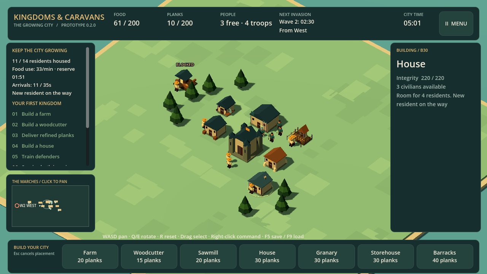

  <section class="section-block ages-intro" aria-labelledby="caravans-intro-title">
    

      

        <h2 id="caravans-intro-title" class="section-title section-label">Early Windows friend playtest</h2>
        
A small survival RTS slice about construction, physical hauling, food, housing, and hard choices.

      

      UNFINISHED · UNSIGNED
    

    

      
This is an early, unfinished, unsigned Windows x64 prototype shared for friendly playtesting. Expect rough edges, balance changes, missing polish, and bugs.

      
The game runs offline after download. Open the game menu and choose Check for updates. When a newer build is available, Download update verifies and prepares it in a separate folder; Restart with update saves your kingdom before switching. Updates need an internet connection to GitHub.

    

  </section>

  <section class="section-block ages-download" aria-labelledby="caravans-download-title">
    

      

        <h2 id="caravans-download-title" class="section-title section-label">Download the playtest</h2>
        
Extract the ZIP, then run the Windows executable.

      

    

    

      

        
Status

        
Early friend playtest

      

      

        <a class="btn-noir" href="https://github.com/RoyGSlade/KingdomsAndCaravans/releases/download/v0.2.1/KingdomsAndCaravans-windows.zip">Download KingdomsAndCaravans 0.2.1</a>
      

    

  </section>

  <section class="section-block" aria-labelledby="caravans-preview-title">
    

      

        <h2 id="caravans-preview-title" class="section-title section-label">A city under pressure</h2>
        
Workers carry materials and goods between buildings while the city prepares for its first night.

      

    

    <figure class="noir-card reading-text">
      
      <figcaption>Preview from the early 0.2 playtest build.</figcaption>
    </figure>
  </section>

  <section class="section-block" aria-labelledby="caravans-loop-title">
    

      

        <h2 id="caravans-loop-title" class="section-title section-label">What to try</h2>
      

    

    

      <article class="noir-card noir-card--lit ages-expansion-card"><h3>Build</h3>
Place farms, woodcutters, sawmills, houses, and a barracks. Teamsters carry reserved planks to each site.
</article>
      <article class="noir-card noir-card--lit ages-expansion-card"><h3>Supply</h3>
Keep a farm staffed, move logs into planks, and protect enough food for workers, soldiers, and new residents.
</article>
      <article class="noir-card noir-card--lit ages-expansion-card"><h3>Defend</h3>
Recruit swordsmen or archers, hold useful ground, and survive six northern raiders followed by twelve from the west.
</article>
    

  </section>

  <section class="section-block ages-limits" aria-labelledby="caravans-feedback-title">
    

      <h2 id="caravans-feedback-title" class="section-title section-label">What we want to learn</h2>
      
After the first wave, can you name two useful investments and pursue one? If something confused you, share what you expected and what actually happened through the <a href="https://github.com/RoyGSlade/KingdomsAndCaravans/issues/new?template=playtest.yml">playtest feedback form</a>.

      
Current build: 0.2.1. <a href="https://github.com/RoyGSlade/KingdomsAndCaravans/releases/tag/v0.2.1">Release notes and checksums</a>.

    

  </section>

